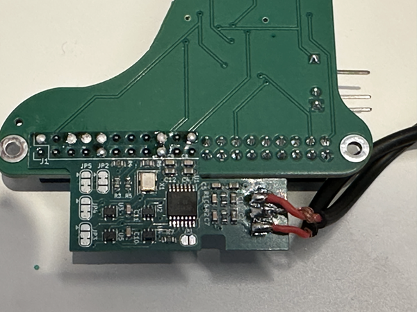
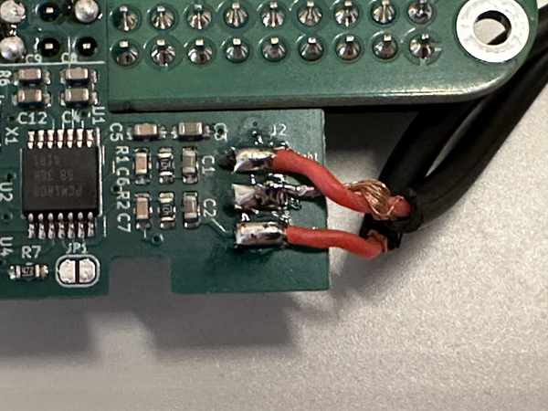
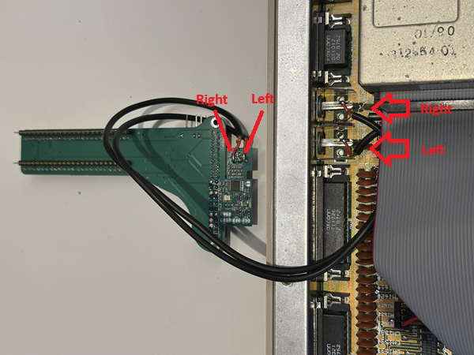
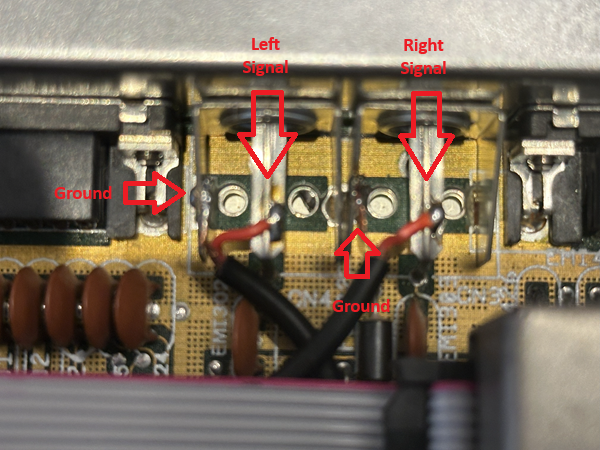
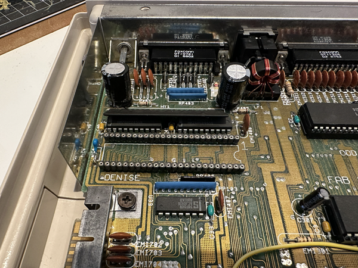
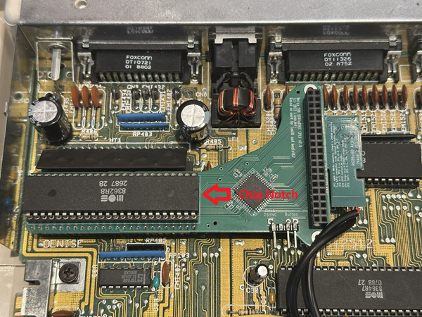
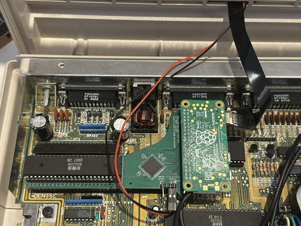
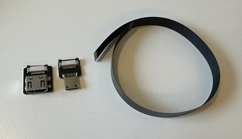
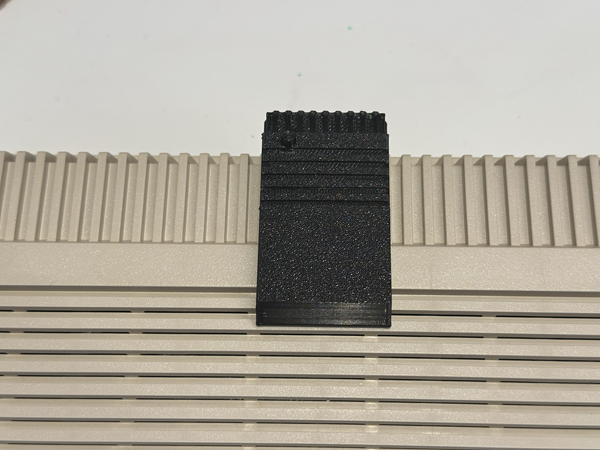
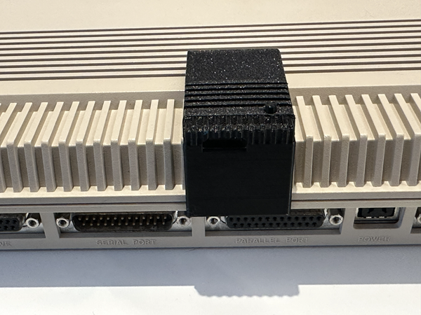

How to install RGBtoHDMI with Audio Module in Amiga 500
=======================================================

### Prerequisits
* Amiga 500
* RaspberryPI Zero or RaspberryPI Zero 2 with GPIO header (https://raspberrypi.dk/produkt/raspberry-pi-zero-2-wh-med-paaloddet-header/)
* MicroSD card 8GB/16GB 
* Audio for RGBtoHDMI board (https://www.c0pperdragon.com/product/18978003/audio-for-rgbtohdmi)
* RGBtoHDMI Amiga 500 board (https://amigastore.eu/en/963-rgb2hdmi-amiga-500-angled.html)
* Wires/cables for internal soldering from Phono Audio Connectors to Audio board pads
* Soldering Iron

## Mounting the RGBtoHDMI and Audio board
When you have all the parts needed, you can start by soldering the Audio board to the RGBtoHDMI boardm, then open up your Amiga 500

1. Turn the RGBtoHDMI upside down and fit the Audio Board with the components up, pay close attention to how the pins are aligned to the left side.

2. Solder the audio wires/cables on to the pads on the right side of the Audio board. Pay close attention to Right (top), Ground (middle) and Left (bottom) It is also written on the board

3. Solder the other end of the wires/cables to the backside of the Amiga audio phono connectors, Left to Left, Right to Right. The ground pad must be soldered to any groundpoint on the Amiga Motherboard, I use the ground on the backside of the Amiga Audio phono connectors.

(Closeup of the Audio Solderpoints)

4. Locate the Denise chip and take it out of the Socket (If you are unlucky and your Denise chip is soldered directy to the Motherboard you have to unsolder it. It can be a pain but not impossible.)

5. Put the RGBtoHDMI board into the Denise socket, and put the Denise chip on top of the RGBtoHDMI board socket
   

6. Now, insert the RaspberryPI Zero to the RGBtoHDMI board GPIO socket and connect the Button wires + HDMI cable.

## External Amiga casing and fitting the HDMI Connector
This is not necessary for the setup to work. But it makes the solution more intergrated and complete in my opinion.
The RaspberryPI Zero Uses HDMI mini connector as output, but most TVs uses regular HDMI size.
You can get a small adaptor ribbon cable from Aliexpress. This enables you to add the HDMI connector without cutting in the Amiga Case

### Ribbon Cable adaptor

Link:
[AliExpress ribbon cable + connectors](https://www.aliexpress.com/item/1005002574813600.html?spm=a2g0o.productlist.main.2.7abd6542hBOBS7&aem_p4p_detail=20251015095948153267328409850002048388&algo_pvid=3460fa03-022a-49d2-b64a-87b6726ba168&algo_exp_id=3460fa03-022a-49d2-b64a-87b6726ba168-1&pdp_ext_f=%7B%22order%22%3A%22235%22%2C%22eval%22%3A%221%22%2C%22fromPage%22%3A%22search%22%7D&pdp_npi=6%40dis%21DKK%216.52%216.52%21%21%210.99%210.99%21%40211b628117605475885611803ef5ca%2112000021219964939%21sea%21DK%210%21ABX%211%210%21n_tag%3A-29910%3Bd%3Abb617586%3Bm03_new_user%3A-29895&curPageLogUid=pTbpCNBgR60L&utparam-url=scene%3Asearch%7Cquery_from%3A%7Cx_object_id%3A1005002574813600%7C_p_origin_prod%3A&search_p4p_id=20251015095948153267328409850002048388_1)

You will need:
* C1 connector
* A4 connector
* FCC-30cm

### Amiga 500 Case Housing STL file for 3D Printing
If you have access to a 3D Printer you can print this case extention for the adaptor
[Download STL file for 3D printing](https://www.printables.com/model/63688-rgbtohdmi-adapter-housing-for-amiga-500)

Print any color you like and click the extention on the Amiga case

## RGBtoHDMI - RaspberryPI SD card Preparations

When you have the Audio board installed you need the version that handles Audio.

Grab the latest release here: (https://github.com/IanSB/RGBtoHDMI/releases)
I use Beta 66 at the moment (When writing this guide)

Original Documentation can be found here: https://github.com/IanSB/RGBtoHDMI/wiki/Audio
But it can be a little unspecific for the hardware we use in the guide.

Now, Download the Beta66.zip file.

1. Format the MicroSD card as FAT32
2. Unzip all the contents of the Beta66.zip file into the root of the MicroSD card
3. Locate the folder Amiga_CPLD_Readme/AmigaCPLD_Setup and copy the Profiles folder and both *.txt files to the root of the MicroSD card. Let it overwrite the file in Profiles folder. (This is a specific profile for the 1-button solution on RGBtoHDMI longboard)

